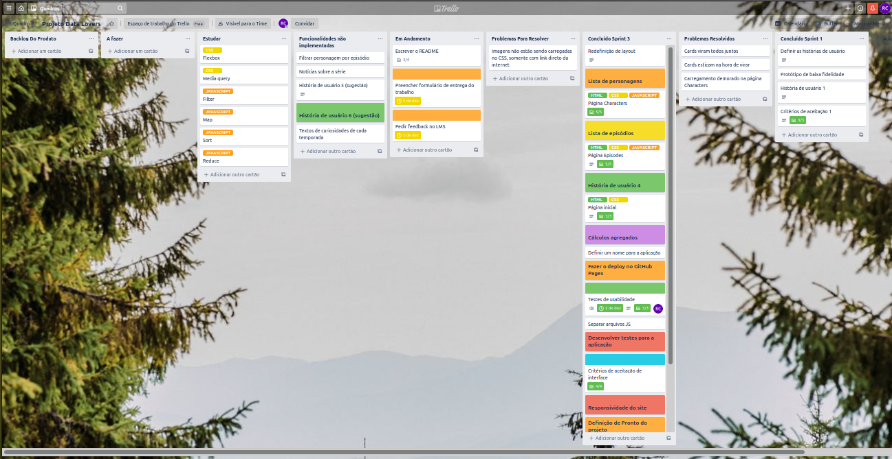
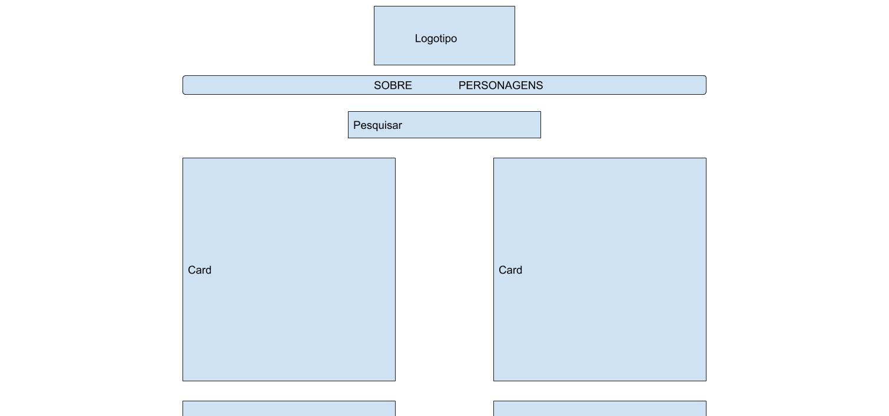

# Rickpedia

## Índice

* [1. Prefácio](#1-prefácio)
* [2. Apresentação do projeto](#2-apresentação-do-projeto)
* [3. Planejamento do projeto](#3-planejamneto-do-projeto)
* [4. Desenvolvimento do projeto](#4-desenvolvimento-do-projeto)
* [5. Habilidades Desenvolvidas](#5-habilidades-desenvolvidas)

***

## 1. Prefácio

O projeto Rickpedia foi criado com inspiração no tema Rick and Morty. Um desenho animado de comédia e ficção científica voltado para o público adulto.

Na animação acompanhamos as aventuras interdimensionais de um cientista alcoólatra, Rick Sanchez, e seu neto, Morty Smith. Eles viajam pelo universo e por diversas dimensões arrumando confusão e quase sempre com o Morty se dando mal de algum jeito.
Entre uma aventura e outra acompanhamos a dinâmica familiar dos personagens, entram em cena: a mãe de Morty e filha de Rick, Beth Smith, a irmã mais velha, Summer Smith, e o pai de Morty, Jeremy Smith. 
A dinâmica familiar é retratada de forma bem real e muitas vezes dramática (como quando o divórcio dos pais de Morty acontece e é mostrado como os filhos lidam com isso), mas sempre com a comédia como pano de fundo para quase todas as situações. 
A animação tem um público grande e fiel, apesar de demorar muito para o lançamento entre uma temporada e outra. Se quiser saber mais sobre a série clique [aqui](https://pt.wikipedia.org/wiki/Rick_and_Morty).

## 2. Apresentação do projeto

O projeto Rickpedia tinha como objetivo fazer a manipulação de dados para trazer para o usuário, através de uma interface amigável, informações sobre o tema escolhido. No caso do tema trabalhado as informações contidas nesses dados eram sobre os personagens e sobre os episódios da série. A aplicação foi pensada e estruturada a partir de pesquisas com usuários e feedback dos testes de usabilidade com os usuários finais do produto. Durante o processo houve a validação das escolhas de funcionalidades a ser desenvolvidas a partir das sugestões dos próprios usuários. 

A aplicação é composta de três páginas: _Home_, _Characters_ e _Episodes_. Ao abrir a aplicação o usuário se depara com a página inicial (denominada _Home_) e encontra informações sobre do que se trata a aplicação, um pouco da história da animação Rick and Morty, link para o site oficial da série e link para assistir a série.
O menu no topo da página apresenta para o usuário as três opções de páginas para navegação. 

Na página _Characters_ os usuários encontram os cards com informações sobre 495 personagens da série. Com a possibilidade de pesquisar cards específicos através dos filtros apresentados no início da página. Passando o mouse em cima do card (ou clicando, no caso dos celulares) o usuário tem acesso a mais informações que constam no verso do card. 

Na página _Episodes_ o usuário tem acesso a lista de todos os episódios da série, apresentados também em cards giratórios, com informações sobre cada episódio e sinopse.
Ainda há a possibilidade de pesquisar os episódios por temporada, utilizando o filtro de pesquisa no início da página. 

Em todas as páginas o usuário encontra no rodapé a possibilidade de compartilhar a aplicação em suas redes sociais, bastando clicar no ícone da rede social desejada. E também encontra o link para o repositório do projeto no GitHub (clicando no ícone do mesmo) e para a minha página do GitHub, clicando no nome da desenvolvedora da aplicação. 

Se quiser conhecer a aplicação e navegar por si mesmo é só clicar [aqui](https://rebecacanesin.github.io/SAP005-data-lovers/index.html). Divirta-se.

## 3. Planejamento do projeto

Todo o planejamento do projeto foi feito utilizando a ferramenta de organização _Trello_. A seguir podemos ver uma imagem da interface com o quadro utilizado na organização desse projeto.

No quadro do _Trello_ podemos visualizar as listas criadas para organização do projeto.
* Backlog do produto
* A fazer
* Estudar
* Funcionalidades não implementadas
* Em andamento
* Problemas para resolver
* Concluído da Sprint vigente (no caso Sprint 3)
* Problemas resolvidos
* Concluído na sprint passada (no caso sprint 1)

O planejamento do projeto seguiu as seguintes etapas:
* Definição de histórias do usuário
* Escolha da história de usuário trabalhada na primeira _sprint_
* Desenho do primeiro protótipo 
* Definição dos critérios de aceitação
* Definição de pronto do projeto
* Desenvolvimento da primeira funcionalidade do projeto, os cards de personagens (HTML, CSS, Javascript)
* Desenvolvimento da segunda e terceira história de usuário (HTML, CSS, Javascript)
* Desenvolvimento da responsividade da aplicação
* Desenvolvimento dos testes unitários
* Testes de usabilidade
* Implementação das melhorias de usabilidade

Para esse projeto optou-se por desenvolver as funcionalidades com as ferramentas HTML, CSS e Javascript sendo trabalhadas em conjunto. Algumas coisas não foram feitas exatamente na ordem do planejamento original.

## 4. Desenvolvimento do projeto

### Histórias de usuário

Nos foi disponibilizada uma pesquisa sobre o tema Rick and Morty que constatava os seguintes pontos:

* É importante para um espectador do show uma aplicação que contenha informações relevantes sobre os personagens, como: nome, gênero, espécie, local de origem, imagem e episódios em que aparece.
* Também é importante para o espectador que a aplicação contenha a lista de personagens do show, o número de episódios e os diferentes locais de origem. 

#### Histórias de usuário definidas no início do projeto
Juntando a pesquisa prévia com uma entrevista feita com um possível usuário da aplicação, definimos seis histórias de usuário. São elas:

* História de usuário 1:
Como usuário quero ter acesso a lista de todos os personagens com informações sobre eles, de modo que eu possa escolher de qual personagem quero informações.

* História de usuário 2:
Como usuário quero ter acesso a uma lista com todos os episódios, de modo que eu possa escolher um episódio e ler o seu resumo.

* História de usuário 3:
Como usuário quero ter acesso a uma lista de locais onde os personagens principais da série foram durante o show, de modo que eu conheça melhor o universo da série.

* História de usuário 4: 
Como usuário quero ter acesso a uma breve história do desenho e sua criação, de modo que eu saiba um pouco mais sobre ele.

* História de usuário 5:
Como usuário quero ter acesso as curiosidades relativas à série, de modo que eu conheça detalhes sobre o show. 

* História de usuário 6:
Como usuário quero ter acesso as notícias mais recentes sobre a série, de modo que eu me mantenha atualizado com relação as datas de estréia de novos episódios.

Convertendo as histórias de usuários em funcionalidades que precisavam ser desenvolvidas para o projeto, temos, na mesma ordem anterior, o seguinte:

1. Lista de todos os personagens na tela, apresentados em cards e com os dados de cada um;

2. Lista de todos os episódios da série com informações e sinopse;

3. Filtro que apresente a lista de locais por onde os personagens principais passaram durante a série;

4. Campo contendo uma breve história sobre a criação do desenho e sua sinopse;

5. Campo contendo texto com curiosidades sobre a série animada;

6. Campo com notícias atuais sobre a série, linkadas de um site de notícias sobre séries.

A história de usuário 1 foi escolhida para dar início ao projeto por ser a mais relevante, levando em consideração os dados de pesquisa previamente disponibilizados e a entrevista realizada. 

#### Formulário de pesquisa com os possíveis usuários

Um formulário de pesquisa sobre a temática do projeto foi criada por uma colega que estava trabalhando com o mesmo tema. As perguntas mais relevantes para entender nossos usuários e seus interesses foram as seguintes:

1. Você usaria um WebApp que apresentasse de maneira visual dados sobre personagens da série/animação que você acompanha? Se sim, como você usaria essa aplicação?

2. Você assiste a série Rick e Morty?

3. Sobre a interface da aplicação, em qual formato você gostaria de visualizar os dados sobre os personagem?

4. Sobre as funcionalidades, o quão relevante para você é filtrar os personagens pelo seu gênero.

5. Sobre as funcionalidades, o quão relevante para você é filtrar os personagens pela sua espécie.

6. Sobre as funcionalidades, o quão relevante para você é filtrar os personagens pelo lugar onde vive.

7. Sobre as funcionalidades, o quão relevante para você é filtrar os personagens pelo lugar de origem. 

8. Sobre as funcionalidades, o quão relevante para você é filtrar os personagens pelo status de vida.

9. Outras sugestões.

10. No futuro, você toparia participar de uma pesquisa de usabilidade dessa plataforma?

#### Resultados encontrados depois da pesquisa com os possíveis usuários

A pesquisa validou as histórias de usuário que tinham sido feitas até então. Os usuários se mostraram interessados em paraticamente todas as funcionalidades que haviam sido pensadas previamente e acrescentaram mais funcionalidades a essa lista.
A única história de usuário que não foi validada, e por isso foi descartada do planejamento, foi a história 3. Na qual faria-se uma funcionalidade para mostrar ao usuários os locais por onde os personagens principais já tinham vivido suas aventuras. 
A pesquisa também validou a apresentação dos personagens na tela com o uso de cards.

As funcionalidades deixadas como sugestão pelos usuários foram as seguintes:
* Poder compartilhar a aplicação nas redes sociais
* Notícias sobre a série
* Filtrar personagens por temporada
* Filtrar personagens por episódio
* Lista de episódios

Segundo os usuários a lista de filtros de personagens por ordem de relevância seria:
* Filtro por espécie
* Filtro por lugar de origem
* Filtro por lugar onde vive
* Filtro por status de vida
* Filtro por gênero

#### Histórias de usuário e funcionalidades implementadas

As histórias de usuário implementadas foram as seguintes:
* História 1: cards com as informações dos personagens na tela
* História 2: lista de episódios com informações e sinopse
* História 4: campo com breve história da série e sinopse

Das funcionalidades deixadas como sugestão inicial pelos usuários, foram implementadas as seguintes:
* Poder compartilhar a aplicação em redes sociais
* Lista de episódios

Dos filtros apontados pelos usuários por ordem de relevância todos foram implementados na aplicação.

#### Histórias de usuário e funcionalidades que não foram implementadas

As histórias de usuário que não foram implementadas foram as seguintes:
* História 3: Filtro com os locais por onde os personagens principais já viveram aventuras (Não validada por usuários)
* História 5: campo com texto de curiosidades sobre a série
* História 6: notícias sobre a série

Das funcionalidades sugeridas pelos usuários, as seguintes não foram implementadas:
* Notícias sobre a série
* Filtrar personagens por temporada
* Filtrar personagens por episódio

#### Desenho de interface de usuário:
Com a primeira história de usuário definida, o primeiro protótipo foi criado para o projeto.

* Protótipo de baixa fidelidade:

### Critérios de aceitação

Para cada história de usuário implementada foram definidos os critérios de aceitação. 

#### Critérios de aceitação História 1
* Lista de todos os personagens
* Personagens apresentados em cards
* Informações relevantes dos personagens nos cards

#### Critérios de aceitação História 2
* Página com a lista de episódios
* Episódios com sinopse
* Episódios apresentados em cards

#### Critérios de aceitação História 4
* Campo contendo texto sobre a série

#### Critérios de aceitação de interface

Para a interface do projeto como um todo foram solicitados e atendidos os seguintes critérios de aceitação de interface:
* Mostrar os dados na tela
* Permitir ordenação de dados
* Permitir filtrar dados
* Ser responsivo

### Definição de pronto 

Para esse projeto foram definidas e atendidas as seguintes definições de pronto:
* Fazer testes de usabilidade
* Implementar melhorias apontadas nos testes de usabilidade
* Código de acordo com a guia de estilos
* Código passando nos testes unitários desenvolvidos
* Código no repositório

### Testes de usabilidade 

Quando a aplicação estava na fase final de desenvolvimento esta foi disponibilizada para que os usuários testassem. Após os testes cada usuário respondeu um questionário de validação dos testes dando um feedback sobre sua experiência com a aplicação. Participaram dos testes nove usuários.

#### Formulário de validação dos testes

O formulário de validação dos testes foi desenvolvido com as seguintes perguntas:

1. O que você achou da localização das coisas na tela?
2. Como foi a navegação no site para você?
3. Foi fácil entender todas as funcionalidades do site?
4. Levando em consideração o tema. Você sentiu falta de alguma informação?
5. Se sentiu falta de alguma informação, conte para a gente.
6. A navegação nos filtros de pesquisa foi fácil?
7. Se não, por quê?
8. Os filtros de pesquisa que estão disponíveis no site são suficientes?
9. Você gostaria que tivesse outra categoria de pesquisa no site?
10. Você excluiria alguma categoria de pesquisa?
11. Quais categorias de pesquisa você incluiria ou excluiria?
12. As cores do site eram agradáveis?
13. Você sentiu alguma dificuldade de leitura, devido a baixo contraste entre as cores das letras e do fundo da página?
14. O layout das páginas estava agradável para você?
15. Os cards facilitaram ou dificultaram a visualização da informação?
16. Se dificultaram, por quê?
17. Se pudesse mudar qualquer coisa no site, o que você mudaria?

Como resultados gerais a maioria dos usuários achou a aplicação de fácil navegação, com layout bom e cores satisfatórias. Conseguiram ler bem a tela, não tiveram problemas de contraste de cor de letra e cor de fundo. Conseguiram achar as informações com facilidade e entenderam facilmente como utilizar as funcionalidades do site. Alguns erros de design foram apontados por alguns usuários, com relação a paleta de cores.

#### Lista de pontos de melhoria apontados pelos usuários

No formulário alguns usuários apontaram melhorias que poderiam ser implementadas para melhorar sua experiência ou porque sentiram falta de alguma informação. Segue a lista de melhorias apontada pelos usuários: 

* Alguns cards tinham o texto vazando na borda inferior
* Poderia ter um aviso informando que o usuário deve clicar nos cards para visualizar as informações
* Diminuir a quantidade de texto na página inicial
* Link ou alguma informação sobre onde assistir a série
* Aumentar o contraste entre o fundo da tela e os elementos nela
* Melhorar a responsividade
* Ter filtros que se somam
* Melhorar a paleta de cores
* Filtrar personagem por episódio
* Caixa de pesquisa por texto na página de episódios
* Feed de notícias na página inicial
* Menu flutuante

#### Melhorias aplicadas ao projeto

De todas as melhorias sugeridas pelos usuários algumas já foram implementadas na aplicação, por parecerem pertinentes para a melhor experiência dos usuários. Segue a lista delas:

* Consertar os cards com texto vazando
* Aviso sobre clicar nos cards
* Menos texto na página inicial
* Link para assistir ao show
* Aumento do contraste do background e caixa de texto
* Melhoria na responsividade

#### Melhorias que serão implementadas no futuro 

Algumas sugestões dos usuários, assim como algumas histórias de usuários ainda não implementadas, foram escolhidas para ser desenvolvidas no futuro. Para melhoria futura da aplicação serão desenvolvidas as seguites funcionalidades:

* Filtros acumulativos
* Filtro de personagem por episódio
* Campo com notícas sobre a série
* Redefinição de design (paleta de cores)
* Input de pesquisa por texto na página de episódios
* Campo de texto com curiosidades sobre a série

## 5. Habilidades Desenvolvidas

Habilidades desenvolvidas durante o projeto:

#### HTML5

* HTML semântico

#### CSS3

* Responsividade:
Flexbox
Media Query

#### Vanilla Javascript

* Manipulação de Array (Filter, sort, map)
* Manipulação dinâmica de DOM 

#### Testes
* Desenvolvimento de testes unitários

#### UX Design

* Pesquisa com o usuário
* História de usuário
* Teste de usabilidade

#### Planejamento

* Definição de pronto do projeto
* Critérios de aceitação de projeto

#### _Soft Skills_
* Lidar com adversidades
* Perseverança
* Adaptabilidade